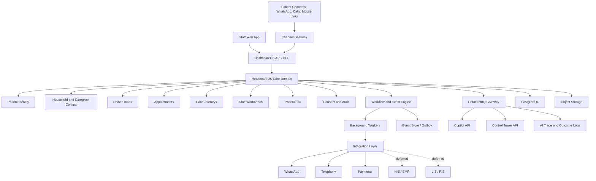

# AI Patient Access and Continuity Platform: Technical Architecture and Stack

## Purpose

This document captures the recommended technical architecture and stack for the HealthcareOS flagship product: the AI Patient Access and Continuity Platform.

The platform should move quickly in MVP while preserving clean boundaries for scale, healthcare governance, integrations, and DatacentrIQ-powered intelligence.

## Architecture Recommendation

Use a TypeScript-first independent-service architecture:

- Next.js for staff and patient-facing web surfaces
- NestJS for the HealthcareOS backend
- PostgreSQL as the primary operational database
- Temporal for durable workflows and long-running care journeys
- Redis for caching, lightweight queues, locks, and realtime support
- S3-compatible object storage for patient documents and media
- DatacentrIQ Gateway for Copilot API and Control Tower API integration

For MVP, organize the parent folder as independently deployable root-level services. This should not be a package monorepo. There should be no root workspace package and no shared contracts package. `core-api` can be modular internally, but web apps, workflow workers, integration adapters, and DatacentrIQ integration should each have their own root folder and deployment boundary.

See [Service Architecture](./service-architecture.md) for the service layout.

## High-Level System Shape

## Frontend Stack

Recommended:

- Next.js
- React
- TypeScript
- Tailwind CSS
- shadcn/ui or Radix UI primitives
- TanStack Query for server-state fetching and caching
- Zustand only for local UI state when needed
- Playwright for end-to-end tests

Frontend principles:

- Build operational screens for speed and clarity.
- Keep staff workflows dense, scannable, and action-oriented.
- Avoid marketing-style layouts inside the application.
- Use role-based navigation and permissions.
- Support live queue updates for inbox, workbench, and escalations.
- Design for Indian healthcare realities: shared family numbers, multilingual communication, high call volume, WhatsApp-heavy workflows, branch operations, and overloaded staff.

## Backend Stack

Recommended:

- NestJS
- TypeScript
- REST APIs first
- OpenAPI/Swagger contracts
- Zod or class-validator for validation
- Prisma or TypeORM for database access
- Modular core service structure

Core API internal modules:

- Identity module
- Inbox module
- Appointment and access module
- Care journey module
- Staff workbench module
- Patient 360 module
- Consent and audit module

Independent root services around the core API:

- `integration-gateway`
- `workflow-worker`
- `datacentriq-gateway`
- `staff-web`
- `patient-web`

Why keep the core API modular:

- Faster MVP execution
- Clear product boundaries without distributed complexity
- Easier transactional consistency for patient identity, tasks, appointments, consent, and audit
- Easier local development and pilot deployment
- Keeps service boundaries explicit without requiring shared runtime packages

## Database

Primary database:

- PostgreSQL

Use PostgreSQL for:

- Tenants and organizations
- Branches and departments
- Patients, caregivers, and family groups
- Appointments and visits
- Interactions and messages
- Tasks and queues
- Care journeys
- Documents metadata
- Consent records
- Audit logs
- AI recommendations and decision traces
- Outcome records

Recommended patterns:

- Strong relational schema for safety-critical entities
- JSONB for flexible workflow metadata, external payloads, and specialty-specific templates
- Strict tenant scoping
- Immutable audit tables
- Soft deletion or suppression for sensitive workflows where appropriate
- Outbox table for reliable event publishing

Possible later additions:

- pgvector for local semantic search or embeddings
- OpenSearch for large-scale patient, message, and document search

## Workflow and Jobs

Recommended:

- Temporal for durable workflows
- Redis/BullMQ only for simpler jobs if needed

Temporal should handle:

- Appointment reminder workflows
- No-show recovery workflows
- Post-visit follow-up journeys
- Chronic-care journey schedules
- Pending diagnostics reminders
- Procedure conversion workflows
- Retry-heavy integration syncs
- Long-running escalations
- SLA timers and task aging

Why Temporal:

- Care journeys are long-running and stateful.
- Reminders and follow-ups need durable timers.
- Integrations fail and need safe retries.
- Staff actions may pause, resume, or close workflows.
- Healthcare workflows need auditability and replayable state.

## Eventing

Start with:

- PostgreSQL outbox pattern
- Internal domain events
- Background workers consuming reliable events

Important domain events:

- message.received
- call.missed
- patient.matched
- patient.identity_conflict_detected
- appointment.booked
- appointment.rescheduled
- appointment.no_show_detected
- visit.completed
- document.uploaded
- report.received
- follow_up.created
- follow_up.due
- task.created
- task.completed
- escalation.created
- ai.recommendation.generated
- ai.recommendation.accepted
- ai.recommendation.rejected
- consent.revoked

Later, add Kafka, NATS, or another broker only when scale or integration volume demands it.

## Realtime

Use realtime updates for:

- Unified Patient Inbox
- Staff Daily Workbench
- Escalation queues
- Appointment confirmation state
- Task assignment and completion

Recommended options:

- WebSockets through NestJS gateway
- Server-Sent Events for simpler one-way queue updates

Prefer the simplest mechanism that keeps staff screens fresh without making the system hard to operate.

## File and Document Storage

Use S3-compatible object storage for:

- Uploaded prescriptions
- Lab reports
- Radiology reports
- Referral documents
- Insurance or TPA documents
- Consent artifacts
- Call recordings where available

Store metadata in PostgreSQL.

Access rules:

- Use signed URLs.
- Enforce role-based access before generating links.
- Log document access.
- Support document quarantine when patient identity is uncertain.
- Support inaccessible or corrupted document states.

## Integration Layer

Build integration adapters instead of hard-coding provider-specific logic into core modules.

Initial adapters:

- WhatsApp Business API
- Telephony provider
- Payment provider

Later adapters:

- HIS / EMR
- LIS / RIS

- ABDM and ABHA-linked workflows
- Additional messaging channels
- Insurance or TPA systems

Integration principles:

- Normalize external events into HealthcareOS domain events.
- Treat upstream systems as unreliable.
- Preserve source payloads for audit and debugging.
- Support delayed sync and reconciliation.
- Make source-of-truth rules explicit.
- Degrade gracefully when an external system is down.

## DatacentrIQ Gateway

HealthcareOS should call DatacentrIQ through the dedicated `datacentriq-gateway` root service.

The DatacentrIQ Gateway wraps:

- Copilot API
- Control Tower API

HealthcareOS modules should not scatter direct DatacentrIQ API calls across product code.

Gateway responsibilities:

- Build governed context payloads
- Enforce tenant and consent boundaries
- Redact or minimize data where required
- Call Copilot API for summaries, drafts, extraction, and explanations
- Call Control Tower API for prioritization, leakage detection, risk detection, next-best actions, and outcome tracking
- Normalize responses into HealthcareOS recommendation objects
- Persist decision traces
- Capture staff acceptance, edits, rejection, and downstream outcomes
- Handle API failure, latency, timeout, and fallback behavior

## DatacentrIQ Usage

Copilot API should support:

- Patient timeline summaries
- Conversation summaries
- Message drafting
- Call-note structuring
- Intent extraction
- Doctor pre-visit briefs
- Follow-up explanation
- Local-language communication assistance

Control Tower API should support:

- Inbox prioritization
- Missed-call recovery prioritization
- No-show risk
- Follow-up leakage detection
- Pending diagnostics detection
- Procedure conversion opportunity detection
- Staff daily workbench prioritization
- Escalation risk detection
- Outcome tracking

Control Tower intelligence should remain embedded inside HealthcareOS workflows. It should not appear as standalone Control Tower applications in the flagship MVP.

## Auth, Security, and Governance

Recommended:

- Auth0, Clerk, or Keycloak depending customer and deployment needs
- Keycloak is attractive if enterprise or private-cloud deployments become important
- RBAC from day one
- Tenant isolation from day one
- Audit logs from day one
- Consent model from day one
- Encryption in transit and at rest

Governance requirements:

- Log all sensitive data access.
- Log all AI recommendations and human actions.
- Require approval for sensitive outbound messages.
- Require approval for patient merge and unmerge.
- Enforce role-based document access.
- Support opt-out and revoked consent.
- Make AI recommendation rationale visible to staff.

## Observability

Recommended:

- OpenTelemetry for tracing
- Sentry or equivalent for application errors
- Prometheus and Grafana for infrastructure and service metrics
- Structured logs with tenant, request, workflow, and correlation IDs

Track:

- API latency
- DatacentrIQ API latency and failure rate
- Integration failure rate
- Workflow failures and retries
- Message delivery failures
- Task queue age
- AI recommendation acceptance and rejection
- Staff action completion
- Patient journey completion

## Deployment

MVP deployment:

- Dockerized services
- Managed PostgreSQL
- Managed Redis
- Managed object storage
- Managed Temporal Cloud or self-hosted Temporal depending constraints
- Cloud deployment in an India region when customer requirements demand it

Later:

- Kubernetes if deployment complexity, scale, or enterprise isolation requires it
- Realtime gateway if live collaboration or high-frequency queue updates require a separate runtime

## Recommended MVP Stack

Use this as the default unless a strong constraint changes the decision:

- Staff frontend service: Next.js, React, TypeScript, Tailwind CSS, shadcn/ui or Radix UI, TanStack Query
- Patient frontend service: Next.js, React, TypeScript, Tailwind CSS, mobile-first routes
- Core API service: NestJS, TypeScript, REST, OpenAPI
- Workflow worker service: Temporal TypeScript workers
- Integration gateway service: TypeScript service with provider adapters
- DatacentrIQ gateway service: TypeScript service wrapping Copilot API and Control Tower API
- Database: PostgreSQL
- Workflow: Temporal
- Cache and realtime support: Redis
- Object storage: S3-compatible storage
- Eventing: PostgreSQL outbox pattern
- Search: PostgreSQL full-text search for MVP
- Observability: OpenTelemetry, Sentry, Prometheus, Grafana
- Testing: Vitest or Jest, Playwright, contract tests for integrations
- AI integration: DatacentrIQ Gateway wrapping Copilot API and Control Tower API

Each service should install and manage its own dependencies. If two services use the same library, that is acceptable duplication in exchange for independent deployability.

## Open Technical Decisions

- Prisma vs TypeORM for ORM
- Auth0, Clerk, or Keycloak for authentication
- Temporal Cloud vs self-hosted Temporal
- WebSockets vs Server-Sent Events for first realtime workflows
- Postgres full-text search vs early OpenSearch
- Whether deployment targets public cloud only, India-region cloud, private cloud, or customer-controlled environments
